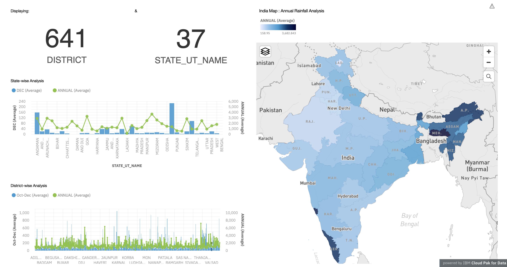
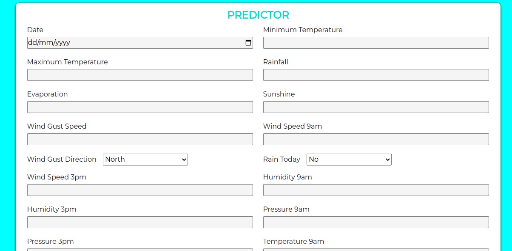
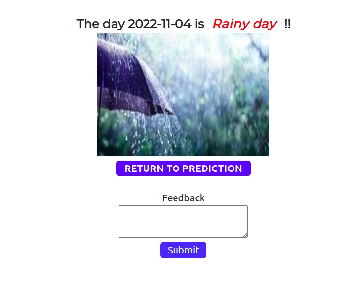

# Exploratory Analysis of RainFall Data in India for Agriculture
`This project is taken as a part of Professional Readiness for Innovation, Employability and Entrepreneurship [Nalaiya Thiran]`

_Agriculture is the backbone of the Indian economy. For agriculture, the most important thing is water source, i.e. rainfall. The prediction of the amount of rainfall gives alertness to farmers by knowing early they can protect their crops from rain. So, it is important to predict the rainfall accurately as much as possible. Exploration and analysis of data on rainfall over various regions of India and especially the regions where agricultural works have been done persistently in a wide range. With the help of analysis and the resultant data, future rainfall prediction for those regions using various machine learning techniques such as XGBoost classifier, SVM classifiers, Decision tree, Naive bayes classifier, Logistic regression._

## Team ID : PNT2022TMID12561
1. Rakesh M [718019Z235]
2. Soumen Saha [718019Z245]
3. Sudharsan V [718019Z249]
4. Vivekanandhan S [718019Z261]

 
[comment]: # (Industry Mentors: _Mahidhar_, _Mohammed Azhar Uddin_)

Faculty Mentor: _Dr. Kavitha C_, Assistant Professor (Sl. Gr.), [PSG College of Technology, Coimbatore](https://www.psgtech.edu/)

## Features & Screenshots:

- Registration & Login: _For user account creation and login_

- Dashboard: _showing rainfall analysis of India_

- Home Page: _for navigating to other modules_

- Predictor: _for predicting the rainfall_

- Result & Feedback: _for showing predicted output and customer support_

